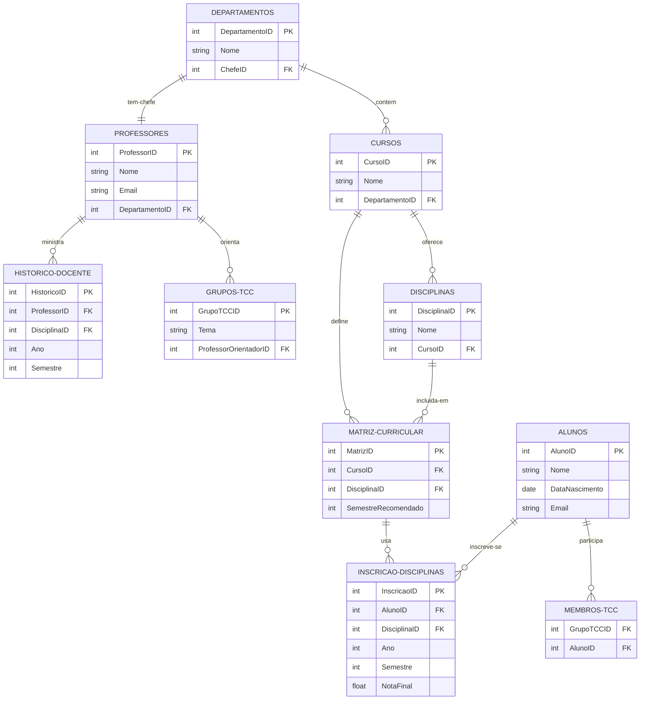

# Projeto-DB

## Alunos

## Desc

## Diagrama relacional

```mermaid
erDiagram
    ALUNOS ||--o{ INSCRICAO-DISCIPLINAS : inscreve-se
    ALUNOS ||--o{ MEMBROS-TCC : participa
    PROFESSORES ||--o{ HISTORICO-DOCENTE : ministra
    PROFESSORES ||--o{ GRUPOS-TCC : orienta
    DEPARTAMENTOS ||--|| PROFESSORES : tem-chefe
    DEPARTAMENTOS ||--o{ CURSOS : contem
    CURSOS ||--o{ DISCIPLINAS : oferece
    DISCIPLINAS ||--o{ MATRIZ-CURRICULAR : incluida-em
    CURSOS ||--o{ MATRIZ-CURRICULAR : define
    MATRIZ-CURRICULAR ||--o{ INSCRICAO-DISCIPLINAS : usa

    ALUNOS {
        int AlunoID PK
        string Nome
        date DataNascimento
        string Email
    }

    PROFESSORES {
        int ProfessorID PK
        string Nome
        string Email
        int DepartamentoID FK
    }

    DEPARTAMENTOS {
        int DepartamentoID PK
        string Nome
        int ChefeID FK
    }

    CURSOS {
        int CursoID PK
        string Nome
        int DepartamentoID FK
    }

    DISCIPLINAS {
        int DisciplinaID PK
        string Nome
        int CursoID FK
    }

    MATRIZ-CURRICULAR {
        int MatrizID PK
        int CursoID FK
        int DisciplinaID FK
        int SemestreRecomendado
    }

    INSCRICAO-DISCIPLINAS {
        int InscricaoID PK
        int AlunoID FK
        int DisciplinaID FK
        int Ano
        int Semestre
        float NotaFinal
    }

    HISTORICO-DOCENTE {
        int HistoricoID PK
        int ProfessorID FK
        int DisciplinaID FK
        int Ano
        int Semestre
    }

    GRUPOS-TCC {
        int GrupoTCCID PK
        string Tema
        int ProfessorOrientadorID FK
    }

    MEMBROS-TCC {
        int GrupoTCCID FK
        int AlunoID FK
    }
```
