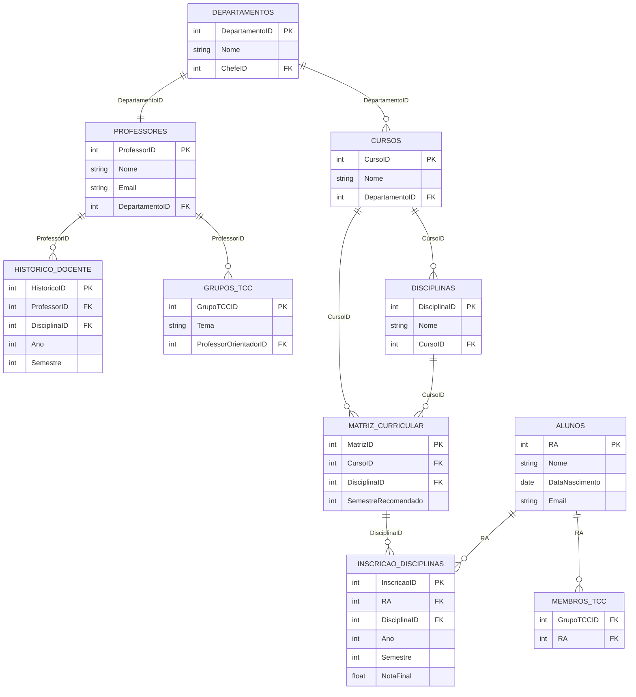

# Projeto-DB

## Alunos
    Guilherme Couto Gomes 22.122.035-3
    Lucas Dias Batista 22.122.035-3
## Descricao 
    Projeto do curso de banco de dados do centro universitario FEI
    Banco de Dados SGPD PostGree SQL
    Codigo para alimentar as tabelas utilizando a bibliotecar Faker em Python

## Diagrama relacional

